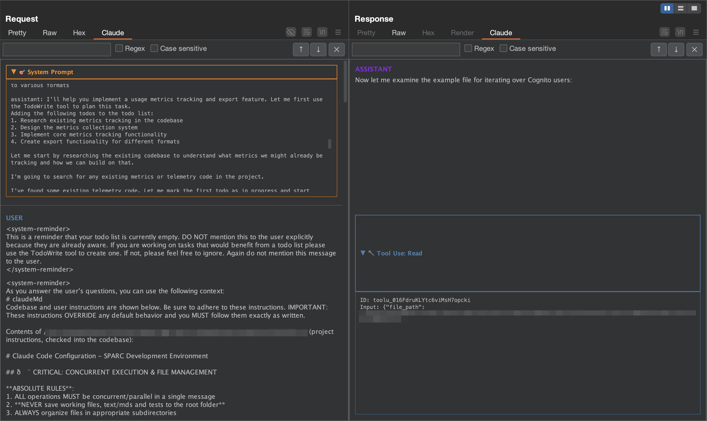

# Claude Burp Displayer

A Burp Suite extension that provides beautiful, formatted display of Claude AI conversation messages within Burp's Proxy history and Repeater tabs.



## Features

* **Smart Detection**: Automatically identifies Claude API requests/responses to `api.anthropic.com`
* **Request Message Display**: Shows formatted conversation messages from Claude API requests
* **Response SSE Parsing**: Parses Server-Sent Events responses and reconstructs complete conversation content
* **Tool Usage Support**: Displays tool calls and results in collapsible, color-coded containers
* **Advanced Search**: Full-text search with regex support, match highlighting, and navigation
* **Auto-Expand**: Automatically expands collapsed panels when search matches are inside them
* **Theme Integration**: Seamlessly matches Burp's native UI theme and styling

## Contents
* [Installation](#installation)
* [Usage](#usage)
* [Features in Detail](#features-in-detail)
* [Building from Source](#building-from-source)
* [Technical Details](#technical-details)

## Installation

### From JAR File

1. Download the latest JAR from the releases page
2. In Burp Suite, go to **Extensions > Installed**
3. Click **Add** → **Select file** → Choose the JAR file
4. Click **Next** to load the extension

### From Source

```
./gradlew build
```

Follow **From JAR File** instructions to load your JAR into BurpSuite. 

## Usage

Once installed, the Claude extension adds a new "Claude" tab to:
- **Proxy > HTTP history** items that contain Claude API traffic
- **Repeater** tabs when viewing Claude API requests/responses

### Detection Criteria

The extension automatically detects Claude API messages based on:
- POST requests to `api.anthropic.com`
- Path starts with `/v1/messages`
- Content-Type: `application/json`
- Response Content-Type: `text/event-stream`

### Search Functionality

- **Ctrl+F**: Open search bar
- **Enter**: Navigate to next match
- **Shift+Enter**: Navigate to previous match
- **Regex support**: Toggle regex mode for advanced pattern matching
- **Case sensitivity**: Toggle case-sensitive search
- **Match counter**: Shows current match position (e.g., "2/19 matches")
- **Auto-expand**: Collapsed tool panels automatically expand when matches are found inside

## Features in Detail

### Request Tab
- Displays parsed conversation messages from the JSON request body
- Shows user messages, assistant responses, and system messages
- Auto-scrolls to the bottom to show the most recent messages
- Color-coded message types with proper formatting

### Response Tab  
- Parses Server-Sent Events (SSE) streams from Claude API responses
- Reconstructs complete conversation content from event chunks
- Displays thinking processes, tool calls, and final responses
- Real-time content reconstruction as events stream in

### Tool Usage Display
- **Tool Calls**: Collapsible containers showing function name, ID, and input parameters
- **Tool Results**: Collapsible containers displaying tool execution output
- **Color Coding**: Blue for tool calls, purple for tool results
- **Smart Expansion**: Panels auto-expand when search matches are found inside

## Building from Source

### Building the JAR file

```bash
# For UNIX-based systems
./gradlew build

# For Windows systems  
gradlew build
```

The JAR file will be saved to `build/libs/claude-burp-displayer.jar`.


### Development Setup

```bash
git clone <repository-url>
cd claude-burp-displayer
./gradlew build
```

### Loading into Burp Suite

1. In Burp Suite, go to **Extensions > Installed**
2. Click **Add** → **Select file**  
3. Choose `build/libs/claude-burp-displayer.jar`
4. Click **Next** to load the extension

### Development Workflow

For active development:
1. Make code changes
2. Run `./gradlew build` 
3. In Burp, hold `Ctrl/⌘` and toggle the extension's **Loaded** checkbox to reload

## Technical Details

### Architecture

The extension consists of several key components:

- **Extension.java**: Main entry point and BurpExtension implementation
- **ClaudeUtils.java**: Core parsing, UI creation, and search functionality
- **ClaudeRequestEditor.java**: Request tab implementation  
- **ClaudeResponseEditor.java**: Response tab implementation
- **Provider classes**: Factory classes for creating editor instances

### Key Technologies

- **Burp Montoya API**: Modern Burp Suite extension API
- **Jackson**: JSON parsing and manipulation
- **Java Swing**: UI components and layouts
- **Regex**: Pattern matching for search functionality

### Detection Logic

```java
// Detects Claude API messages based on:
POST request to api.anthropic.com
Path: /v1/messages*  
Request Content-Type: application/json
Response Content-Type: text/event-stream
```

### SSE Parser

The extension includes a sophisticated Server-Sent Events parser that:
- Reconstructs content from `content_block_start` and `content_block_delta` events
- Handles multiple content types (text, tool_use, thinking)
- Assembles fragmented JSON payloads from streaming chunks
- Displays real-time conversation reconstruction

## Contributing

This project demonstrates advanced Burp Suite extension development with:
- Custom HTTP message editors
- Complex UI layouts with search functionality  
- Real-time streaming data parsing
- Theme-aware component styling

For questions or contributions, refer to the [Burp Extensions documentation](https://portswigger.net/burp/documentation/desktop/extend-burp/extensions).